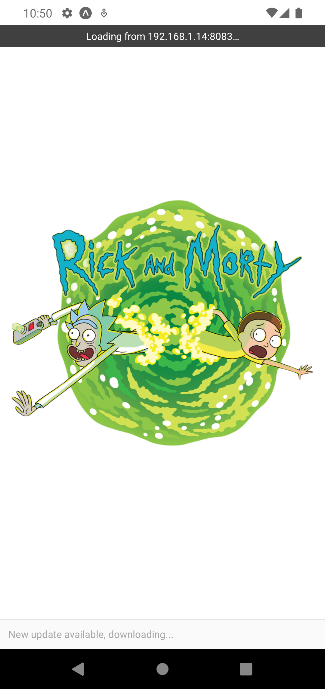
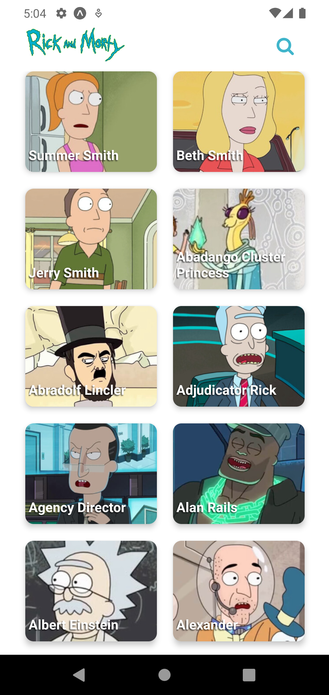
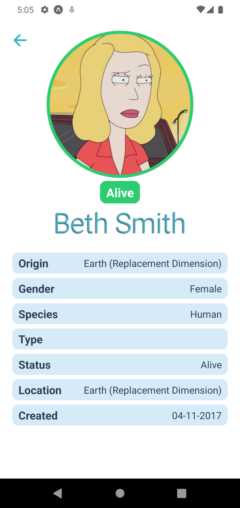
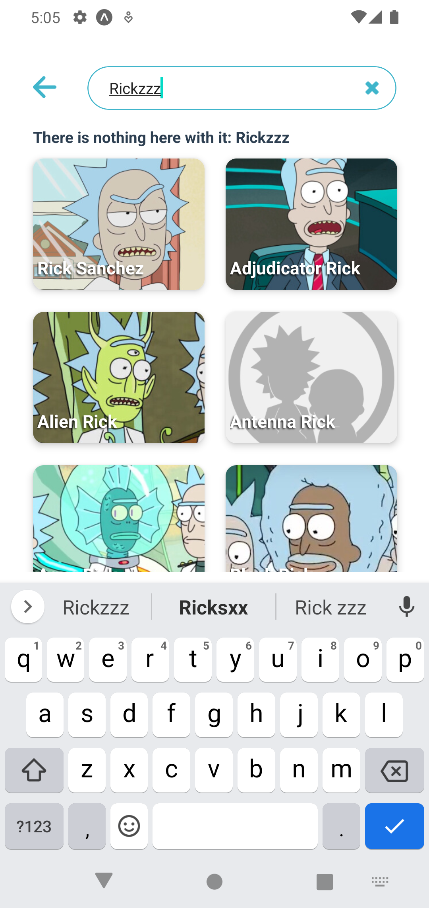
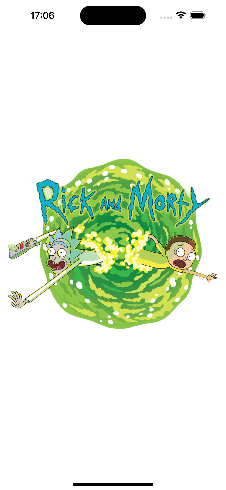
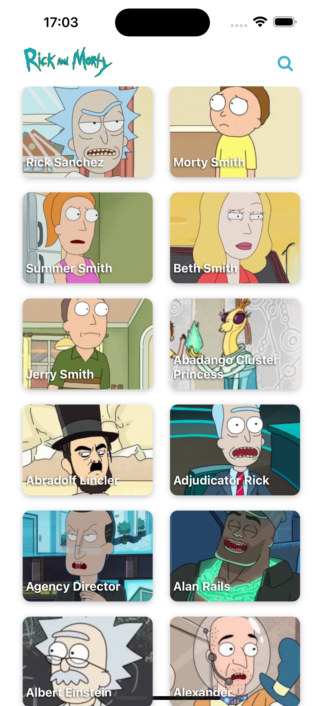
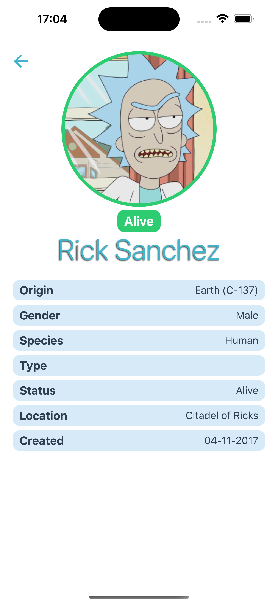
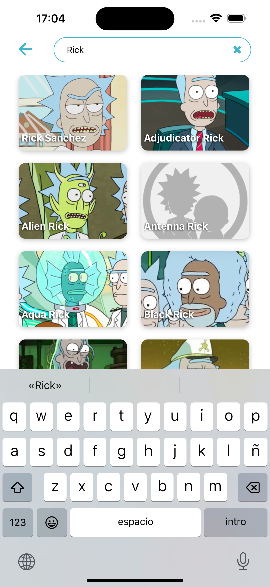

# Rick And Morty App con React Native - NTECH SOFTWARE

## Descripción del Proyecto
Aplicación móvil para explorar y buscar personajes de Rick and Morty.

## Requisitos:

1. **Entorno de Desarrollo:**
   - [Node.js](https://nodejs.org/) (versión 14.0.0 o superior)
   - [npm](https://www.npmjs.com/) (versión 6.0.0 o superior)
   - [Expo CLI](https://docs.expo.dev/get-started/installation/) (para proyectos Expo)

2. **Herramientas y Dependencias:**
   - [Expo Go](https://expo.dev/client) instalado en dispositivos móviles para pruebas en tiempo real
   - Simuladores iOS o Android en tu ordenador. 

Asegúrate de tener todas las herramientas y dependencias instaladas y configuradas según las especificaciones para garantizar un desarrollo sin problemas en el entorno Expo.


## Estructura del Proyecto
La estructura de carpetas propuesta para el proyecto está diseñada para proporcionar una organización clara

- `api/`: Carpeta dedicada a la configuración inicial con Axios para realizar solicitudes a la API.
- `app/`: Carpeta que alberga todas las pantallas y sirve como punto de inicio de la aplicación.
- `assets/`: Carpeta contenedora de archivos multimedia.
- `components/`: Carpeta destinada a almacenar todos los componentes visuales utilizados en la aplicación.
- `hooks/`: Carpeta que almacena hooks personalizados y lógica reutilizable utilizada en la aplicación.
- `types/`: Carpeta que contiene definiciones de tipos utilizadas en toda la aplicación.
- `utils/`: Carpeta que almacena servicios y utilidades generales para la aplicación.


## Configuración del Entorno
Siga estos pasos para configurar correctamente su entorno de desarrollo y ejecutar la aplicación en su máquina local:

1. **Clonar el Repositorio y acceder al proyecto:**
   ```cmd
   git clone https://github.com/carlos0519bo/rick-and-morty-app-ntech.git
   cd rick-and-morty-app-ntech
   ```
2. **Instalar dependencias y módulos de NODE:**
   ```cmd
   npm install
   ```
2. **Inicia el proyecto en los simuladores y dispositivos externos:**
   
   Para dispositivos iOS
   ```cmd
   npm run ios
   ```
   Para dispositivos Android
   ```cmd
   npm run android
   ```

   Para iniciar la app en tu dispositivo físico, deberás de escanear el código QR que te saldrá en la terminal. Para esto deberás de tener instalado Expo Go.

## Funcionalidades Implementadas

### Lista de Personajes
- **Descripción:** En la pantalla inicial, los usuarios pueden explorar una lista completa de todos los personajes de Rick and Morty.
- **Implementación:**
  - Se realiza una solicitud a la API de Rick and Morty para obtener la lista de personajes.
  - La lista se presenta mostrando información clave como nombre e imagen.

### Detalles del Personaje
- **Descripción:** Al hacer clic en un personaje de la lista, los usuarios pueden ver detalles más específicos sobre ese personaje.
- **Implementación:**
  - Se implementa la navegación para llevar a los usuarios a una pantalla de detalles cuando hacen clic en un personaje.
  - La pantalla de detalles muestra información más detallada sobre el personaje, como su nombre, especie, estado, etc.

### Pantalla de Búsqueda
- **Descripción:** Los usuarios pueden buscar personajes específicos utilizando la pantalla de búsqueda.
- **Implementación:**
  - Se proporciona una barra de búsqueda en la parte superior de la pantalla inicial.
  - A medida que los usuarios escriben, se filtran automáticamente los resultados según la entrada del usuario.

### Conexión a la API
- **Descripción:** La aplicación se conecta a la API de [Rick and Morty](https://rickandmortyapi.com/) para obtener datos actualizados.
- **Implementación:**
  - Se utiliza la configuración de Axios para realizar solicitudes HTTP a la API.
  - Se manejan los casos de éxito y error de las solicitudes para proporcionar una experiencia de usuario fluida.

Estas funcionalidades proporcionan a los usuarios una experiencia completa para explorar, conocer detalles y buscar personajes de Rick and Morty a través de la aplicación.

## Capturas de Pantalla
Capturas de pantalla de la aplicación en diferentes estados o de las funcionalidades implementadas.

### Vista en Dispositivo Android
<div style="display: flex; flex-direction: 'row'; gap:5px;">




</div>

### Vista en Dispositivo iOS
<div style="display: flex; flex-direction: 'row'; gap:5px;">




</div>

## Recursos Utilizados
Durante el desarrollo de la aplicación, se utilizaron diversos recursos para facilitar y mejorar el proceso de creación. A continuación se detallan algunos de los recursos clave:

1. **[Expo](https://expo.dev/):**
   - Plataforma y conjunto de herramientas que simplifican la construcción de aplicaciones React Native de manera rápida y sencilla.

2. **[Axios](https://axios-http.com/):**
   - Cliente HTTP basado en Promesas para realizar solicitudes a la API de Rick and Morty.

3. **[FlashList](https://shopify.github.io/flash-list/):**
   - Alternativa eficiente a FlatList para realizar operaciones similares de manera más efectiva.

4. **[Expo Router](https://docs.expo.dev/router/introduction/):**
   - Expo Router es un enrutador diseñado para aplicaciones React Native, permitiendo gestionar la navegación entre pantallas.

5. **[Rick and Morty API](https://rickandmortyapi.com/):**
   - API que ofrece datos de personajes, ubicaciones y episodios de la serie Rick and Morty.

6. **[Visual Studio Code](https://code.visualstudio.com/):**
   - Editor de código fuente altamente configurable y eficiente.